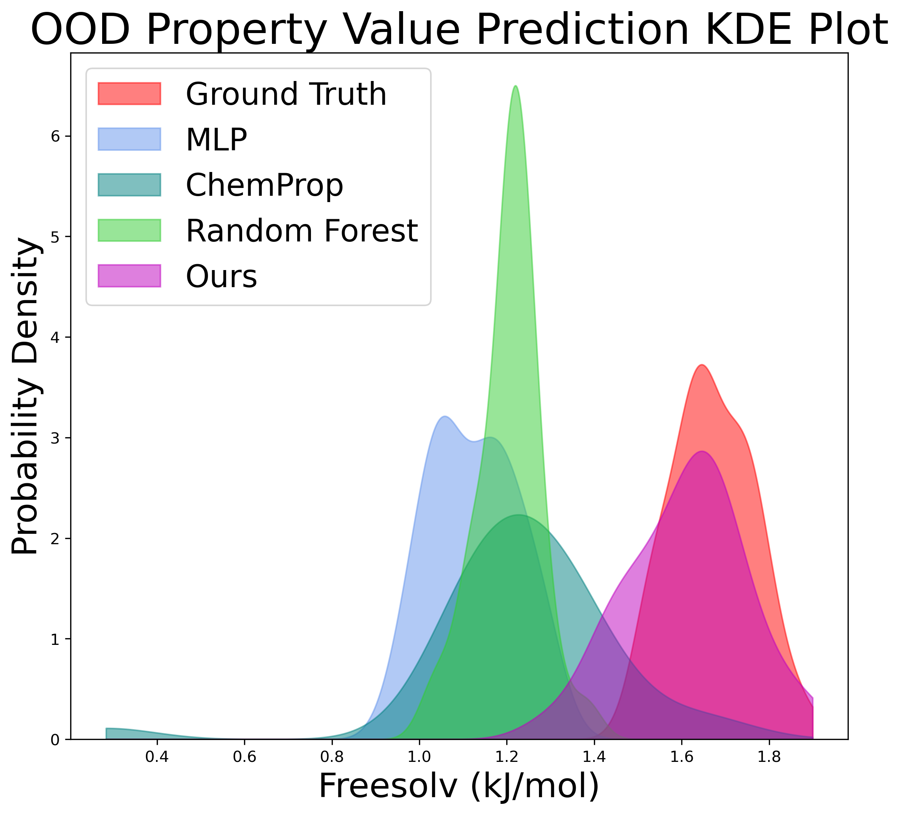

[//]: # ()
[//]: # (  
You can also find my articles on <a href="{{site.author.googlescholar}}">my Google Scholar profile</a>.
)
[//]: # ()



<h2> Known Unknowns: Out-of-Distribution Property Prediction in Materials and Molecules </h2>

**Nofit Segal**\*, Aviv Netanyahu\*, Kevin Greenman, Pulkit Agrawal, Rafael Gomez-Bombarelli \
*in submission*
_AI for Accelerated Materials Design Workshop, Neurips 2024_  _Spotlight Talk_  \
_Next-Generation AI-Catalyzed Scientific Workflow for Digital Materials Discovery Symposium, Materials Research Society fall 2024_ \
[[Paper](https://openreview.net/pdf?id=HkfnueE7Ae)]  
<!-- [[Code](https://github.com/DanHrmti/ECRL)]  [[Website](https://sites.google.com/view/entity-centric-rl/)]   -->
<!-- [[Talk](https://youtu.be/1YJCWyLcGHk?t=1)] -->

  
<h1> Workshop Papers </h1>

<!-- <h2> Known Unknowns: Out-of-Distribution Property Prediction in Materials and Molecules </h2>
**Nofit Segal**\*, Aviv Netanyahu\*, Kevin Greenman, Pulkit Agrawal, Rafael Gomez-Bombarelli \
_AI for Accelerated Materials Design , Neurips 2024_ -->

\* Indicates equal contribution

