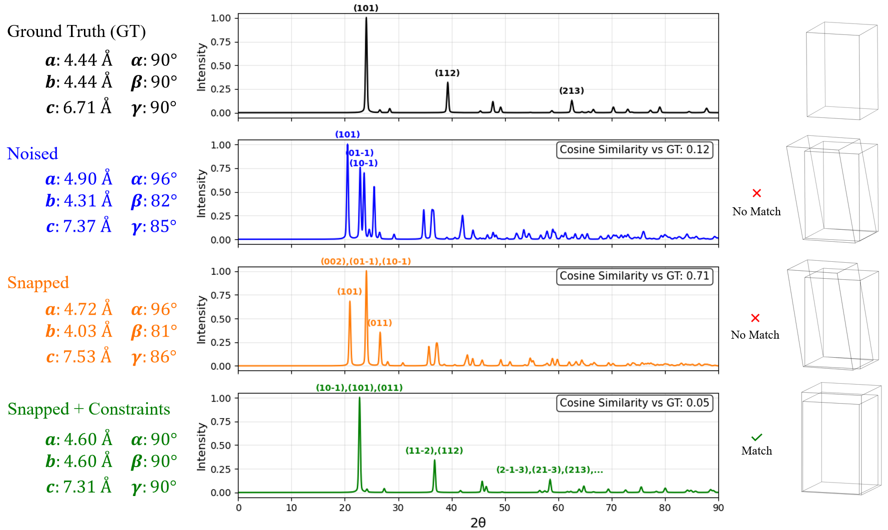
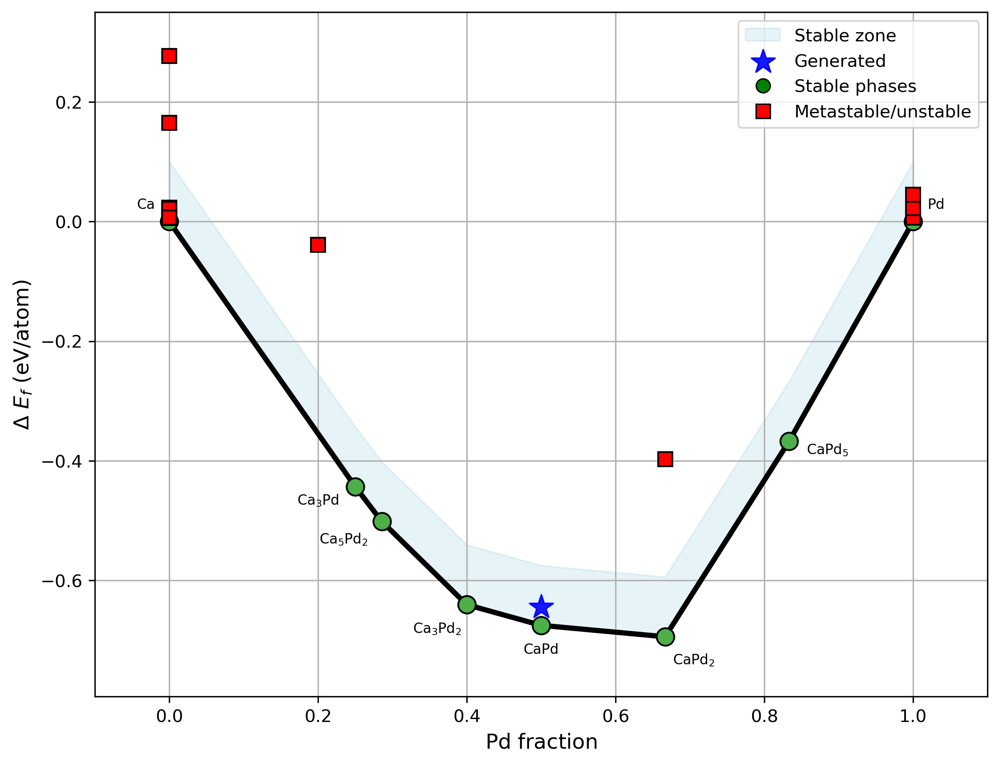
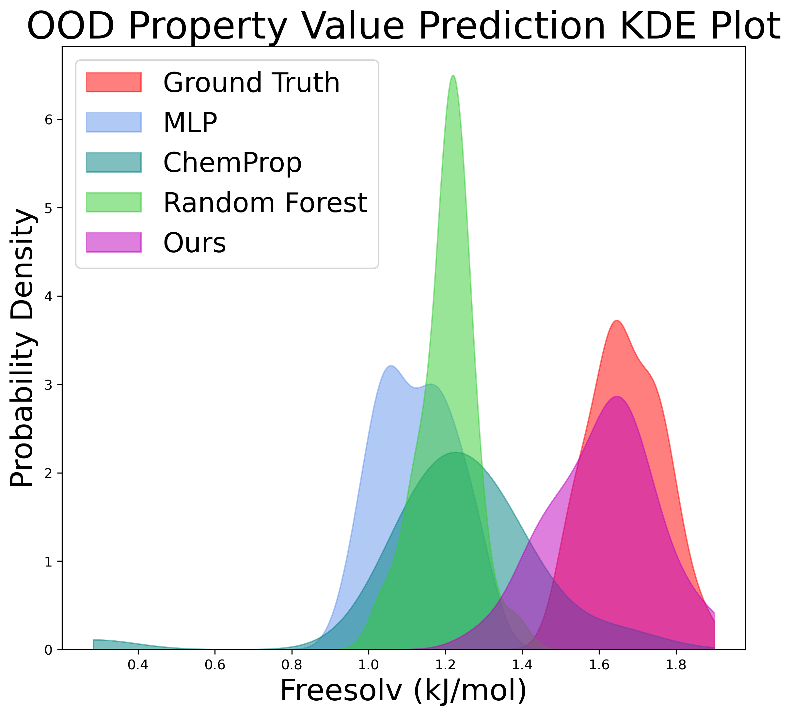
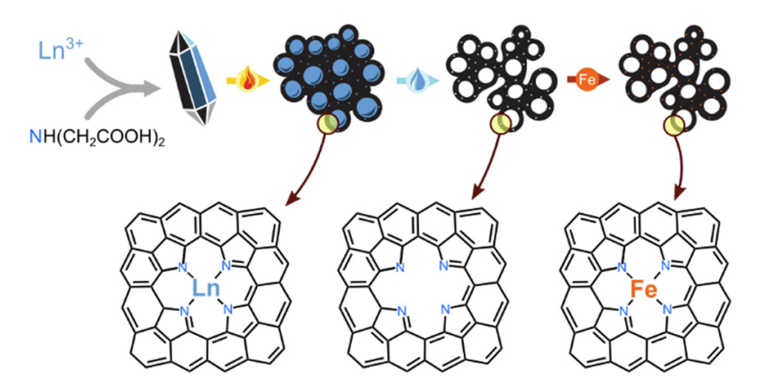

[//]: # ()
[//]: # (  
You can also find my articles on <a href="{{site.author.googlescholar}}">my Google Scholar profile</a>.
)
[//]: # ()



<h2> The Loss Landscape of XRD-Based Structure Optimization Is Too Rough for Gradient Descent </h2>

**Nofit Segal**, Akshay Subramanian, Minga Li, Benjamin Kurt Miller, Rafael Gomez-Bombarelli\
_AI for Accelerated Materials Design Workshop, NeurIPS 2025_ \ 

<h2> Towards Generating Stable Materials via Large Language Models with Reinforcement Learning Finetuning </h2>

Zhang-Wei Hong\*, **Nofit Segal**\*, Raina Wu, Aviv Netanyahu, Hoje Chun, Rafael Gomez-Bombarelli, Pulkit Agrawal  \
_The Reach and Limits of AI for Scientific Discovery, NeurIPS 2025_ \

<h2> Known Unknowns: Out-of-Distribution Property Prediction in Materials and Molecules </h2>

**Nofit Segal**\*, Aviv Netanyahu\*, Kevin Greenman, Pulkit Agrawal, Rafael Gomez-Bombarelli \
_NPJ Computationa Materials 2025_ \ 
_AI for Accelerated Materials Design Workshop, NeurIPS 2024_  _Spotlight Talk_  \
_Next-Generation AI-Catalyzed Scientific Workflow for Digital Materials Discovery Symposium, Materials Research Society (MRS), Fall 2024_ \
[[Paper](https://arxiv.org/abs/2502.05970)]  [[code](https://github.com/learningmatter-mit/matex)]
<!-- [[Talk](https://youtu.be/1YJCWyLcGHk?t=1)] -->

<!--    -->

<h2> Lanthanoid coordination compounds as diverse self-templating agents towards hierarchically porous Fe–N–C electrocatalysts </h2>

Itamar Salton, Karina Ioffe, Tomer Y Burshtein, Eliyahu M Farber, Nicola M Seraphim, **Nofit Segal**, David Eisenberg \
_Materials Advances 2022_ \
[[Paper](https://pubs.rsc.org/en/content/articlepdf/2022/ma/d2ma00596d)]  

<!--    -->

\* Indicates equal contribution

