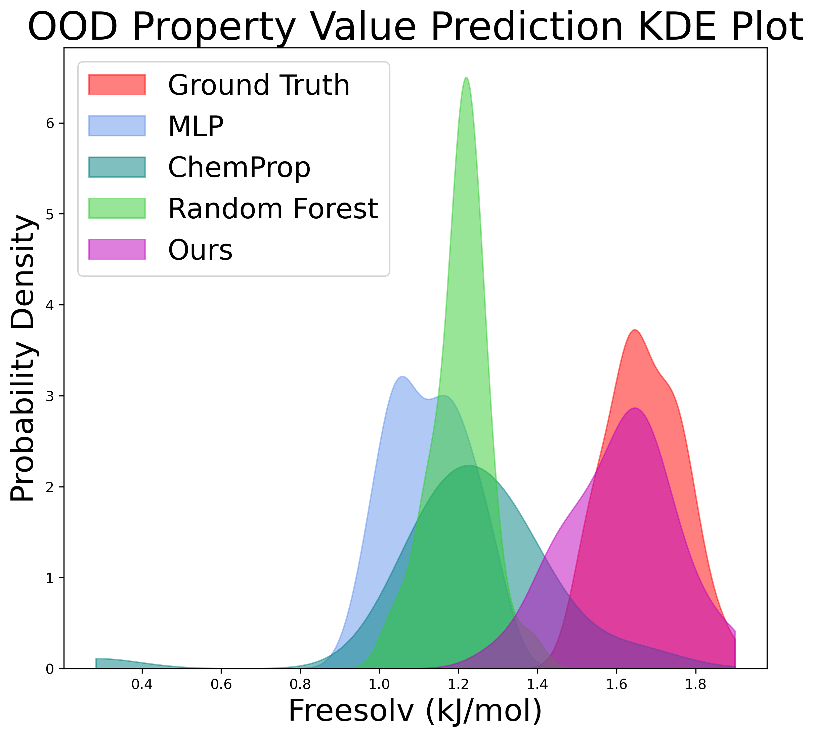

A Comparative Analysis of an E(3) Equivariant GNN and a Non-Equivariant GNN in Materials Data Tasks with a Focus on Investigating the Interpretability of Latent Geometry within the Two GNNs.

Introduction
======

Materials embody a diverse array of chemical and physical properties, intricately shaping their suitability for various applications. The representation of materials as graphs, where atoms serve as nodes and chemical bonds as edges, facilitates a systematic analysis. Graph Neural Networks (GNNs) have emerged as promising tools for deciphering relationships and patterns within materials data. The utilization of GNNs holds the potential to develop computational tools that deepen our understanding and aid in designing structure-property relationships in atomic systems.

In recent years, there has been a heightened focus on employing machine learning for the accelerated discovery of molecules and materials with desired properties [[Min and Cho, 2020](#min2020accelerated); [Pyzer-Knapp et al, 2022](@pyzer2022accelerating); [Merchant et al, 2023](@merchant2023scaling)]. Notably, these methods are exclusively applied to stable systems in physical equilibrium, where such systems correspond to local minima of the potential energy surface \\E(r_1, . . . , r_n)\\, with \\r_i\\ representing the position of atom \\i\\ [[Schüttet al, 2018](@schutt2018schnet)].

The diverse arrangements of atoms in the system result in varying potential energy values, influencing chemical stability. In the GIF below, different trajectories can be seen of the molecule Ethane. The Ethane molecule spends 99% of its time in a specific conformation, in which the substituents are at the maximum distance from each other. This conformation is called the staggered conformation. Looking at the molecule from a position on the C-C (main) axis (as in the second half of the animation), The staggered conformation is reached when the H atoms of the front C atom are exactly between the H atoms of the other C atom. This animation also show the 3-fold symmetry of the molecule around the main axis. All three staggered conformations will have the same energy value, as they are completely equivalent. The intermediate conformations will result in a higher energy value, as they are energetically less favorable. Different conformations can also portray elongations of some bonds lengths and variations in angles value. Predicting stable arrangements of atomic systems is in itself an important challenge! 

  

    Conformations of the molecule Ethane (C2H6)  

In the three-dimensional Euclidean space, materials and physical systems in general, inherently exhibit rotation, translation, and inversion symmetries. These operations form the E(3) symmetry group, a group of transformations that preserve the Euclidean distance between any two points in 3D space. When adopting a graph-based approach, a generic GNN may be sensitive to these operations, but an E(3) equivariant GNN excels in handling such complexities. Its inherent capability to grasp rotations, translations, and inversions allows for a more nuanced understanding, enabling the capture of underlying physical symmetries within the material structures [[Batzner et al, 2022](@batzner20223)].

Data
======

The MD 17 dataset, an extensive repository of ab-initio molecular dynamics trajectories [[Chmiela et al, 2019](@chmiela2019sgdml)], was employed in this study. 

Each trajectory within the dataset includes Cartesian positions of atoms (in Angstrom), their atomic numbers, along with total energy (in kcal/mol) and forces (kcal/mol/Angstrom) acting on each atom. The latter two parameters serve as regression targets in analyses.

Our focus narrowed down to the molecules Aspirin, Ethanol, and Toluene:

The distributions of energy values (kcal/mol) for various conformations of the three molecules, within the training and validation sets, are illustrated in the histograms below.

